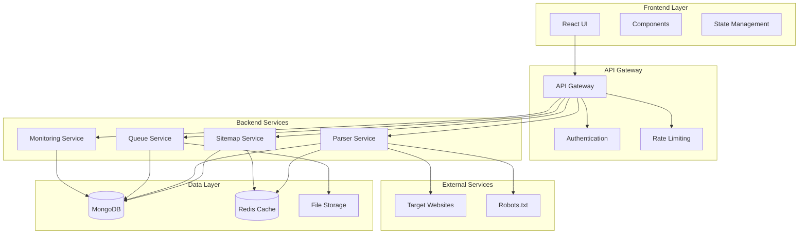
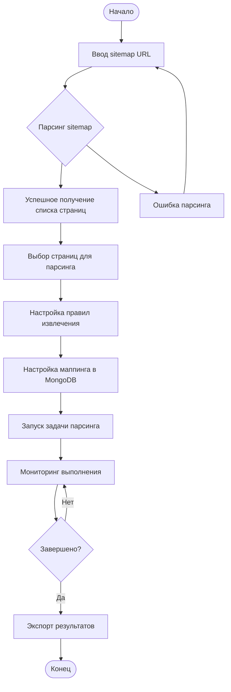
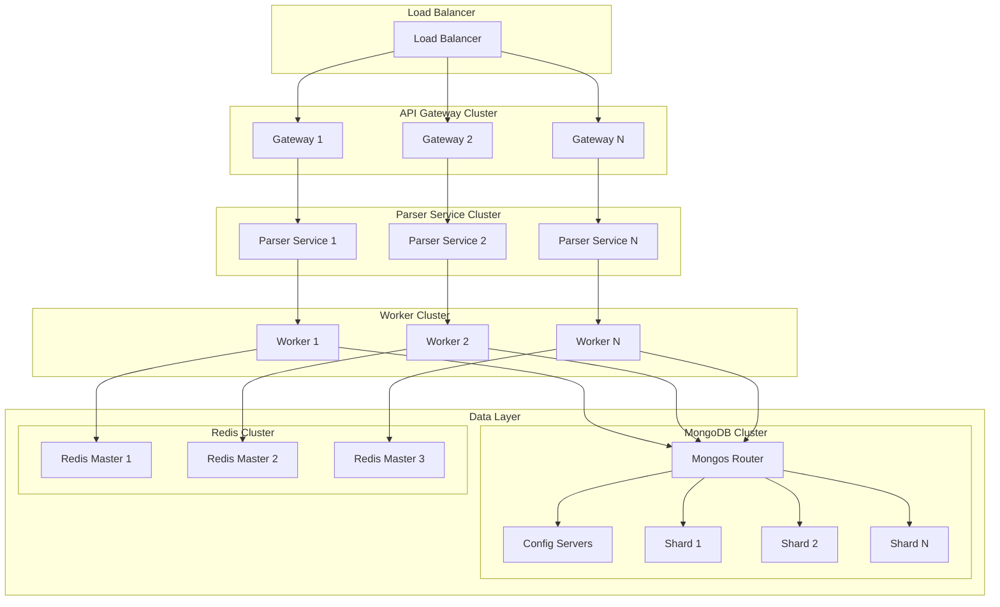
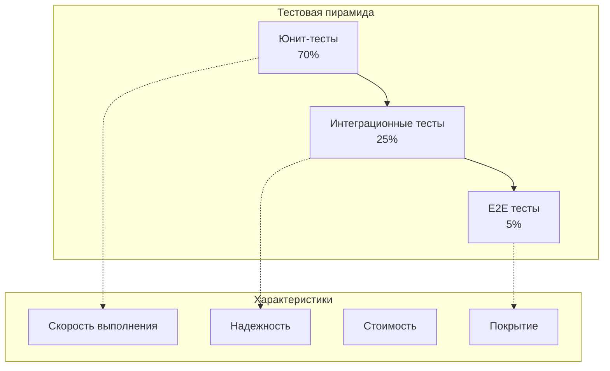
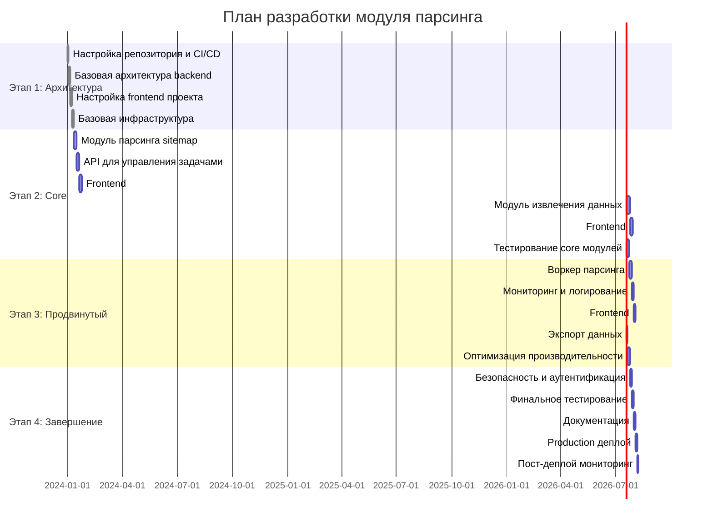

# Техническое задание на разработку модуля парсинга сайтов

## 1. Цель и общая концепция

### 1.1. Цель системы

Разработать модуль парсинга сайтов с веб-интерфейсом, обеспечивающий:

- Загрузку и разбор `sitemap.xml`, включая:
  - обычные файлы (`sitemap.xml`, `sitemap_index.xml`)
  - сжатые файлы (`*.xml.gz`, `sitemap_index.xml.gz`)
  - произвольную глубину вложенности sitemap-индексов
- Автоматическое формирование **полного списка страниц** сайта.
- **Просмотр любой страницы** в UI и **интерактивное выделение блоков** для парсинга (CSS‑селекторы).
- Настройку параметров парсинга (таймауты, задержки, ротация отпечатков, ключевые слова/регексы).
- Сохранение данных в **MongoDB** с настраиваемым маппингом полей.
- Ведение **мониторинга** задач парсинга, логов и статистики.

### 1.2. Основные роли

- **Администратор/разработчик** — управляет конфигурацией, доступами, окружением.
- **Аналитик/оператор** — настраивает парсинг, выделяет блоки, настраивает маппинг и запускает задачи, анализирует результаты.

### 1.3. Архитектурная диаграмма системы



***

## 2. Технологический стек

### 2.1. Backend

- Язык: **Python 3.11+** с асинхронной поддержкой
- Фреймворк: **FastAPI** с автоматической генерацией OpenAPI документации
- Библиотеки:
  - HTTP: `httpx` (асинхронный) с поддержкой HTTP/2
  - Парсинг HTML/XML: `lxml`, `BeautifulSoup4`
  - Работа с gzip: стандартный `gzip` модуль
  - MongoDB: `motor` (асинхронный) с connection pooling
  - Аутентификация: `python-jose` для JWT токенов
  - Валидация: `pydantic` v2 с улучшенной производительностью
  - Очередь задач: `celery` с `redis` broker
  - Мониторинг: `prometheus-client`, `structlog`
  - Тестирование: `pytest`, `pytest-asyncio`, `httpx`

### 2.2. Frontend

- Фреймворк: **React 18** с Concurrent Features
- Язык: **TypeScript 5.0+** со строгой типизацией
- Управление состоянием: **Zustand** (минималистичный) + **React Query** для серверного состояния
- UI-компоненты: **Tailwind CSS** + **Headless UI** для кастомизации
- Дополнительные библиотеки:
  - Формы: `react-hook-form` с `zod` валидацией
  - HTTP клиент: `axios` с интерцепторами
  - Графики: `recharts` для визуализации статистики
  - Выделение элементов: кастомная библиотека на основе `css-selector-generator`

### 2.3. База данных

- **MongoDB 6.0+** с поддержкой транзакций
  - Отдельные коллекции: `tasks`, `pages`, `rules`, `results`, `logs`, `users`
  - Индексы: оптимизированные под типовые запросы
  - Шардирование: подготовка к горизонтальному масштабированию
- **Redis 7.0+** для кеширования и очередей задач

### 2.4. Инфраструктура и DevOps

- Контейнеризация: **Docker** + **Docker Compose** для локальной разработки
- Оркестрация: **Kubernetes** для production
- CI/CD: **GitHub Actions** с автоматическим тестированием и деплоем
- Мониторинг: **Prometheus** + **Grafana** + **Loki**
- Логирование: **ELK Stack** (Elasticsearch, Logstash, Kibana)
- Секреты: **HashiCorp Vault** или Kubernetes Secrets
- Конфигурация: **Helm** charts для Kubernetes

***

## 3. Семантическая разметка кода

### 3.1. Принципы семантической разметки

Все компоненты системы должны следовать принципам семантической разметки, определенным в [`semantic_markup_guide.md`](semantic_markup_guide.md). Это обеспечивает:

- Понятность кода для ИИ-ассистентов
- Улучшенную читаемость для разработчиков
- Автоматическую генерацию документации
- Упрощенный рефакторинг и анализ

### 3.2. Стандарты именования

#### Backend компоненты

```python
# SEMANTIC: Сервис обработки sitemap с асинхронной поддержкой
class SitemapProcessingService:
    """SEMANTIC: Основной сервис для парсинга и обработки sitemap файлов"""
    
    async def parse_sitemap_from_url(self, sitemap_url: str) -> SitemapParseResult:
        """SEMANTIC: Асинхронный парсинг sitemap по URL"""
        
    async def process_nested_sitemaps(self, sitemap_index_url: str) -> List[str]:
        """SEMANTIC: Рекурсивная обработка вложенных sitemap индексов"""

# SEMANTIC: Модель задачи парсинга с валидацией
class ParsingTaskModel(BaseModel):
    """SEMANTIC: Основная модель для хранения конфигурации задачи парсинга"""
    
    # METADATA:
    #   collection_name: "parsing_tasks"
    #   indexes: ["sitemap_url", "status", "created_at"]
    #   ttl_field: "expires_at"
```

#### Frontend компоненты

```typescript
// SEMANTIC: Компонент формы парсера sitemap с валидацией
const SitemapParserForm: React.FC<SitemapParserFormProps> = ({ 
  onParseStart,
  initialUrl 
}) => {
  // SEMANTIC: Состояние формы с типизацией
  const [sitemapUrl, setSitemapUrl] = useState<string>(initialUrl || '');
  const [isParsing, setIsParsing] = useState<boolean>(false);
  
  /**
   * Обработчик отправки формы.
   * 
   * SEMANTIC: Валидация и запуск процесса парсинга sitemap
   */
  const handleSubmit = useCallback(async (event: FormEvent) => {
    // SEMANTIC: Валидация URL перед отправкой
    if (!isValidSitemapUrl(sitemapUrl)) {
      throw new Error('Некорректный URL sitemap');
    }
    
    setIsParsing(true);
    try {
      await onParseStart(sitemapUrl);
    } finally {
      setIsParsing(false);
    }
  }, [sitemapUrl, onParseStart]);
};
```

### 3.3. Метаданные для API эндпоинтов

```python
# SEMANTIC: Контроллер обработки sitemap с метаданными
@router.post("/parse", response_model=SitemapParseResponse, tags=["sitemap"])
async def parse_sitemap_endpoint(
    request: SitemapParseRequest,
    current_user: User = Depends(get_current_user)
) -> SitemapParseResponse:
    """
    API эндпоинт для запуска парсинга sitemap.
    
    SEMANTIC: Инициация асинхронной задачи парсинга структуры сайта
    
    METADATA:
        - endpoint_type: async_task_initiator
        - authentication_required: true
        - rate_limit: 10/minute
        - response_time: <2s
        - cache_ttl: 0
        - monitoring_tags: ["sitemap", "parsing", "async"]
    """
```

***

## 4. Структура интерфейса (вкладки)

### 4.1. Вкладка «Настройка парсинга»

- Ввод `sitemap` URL, разбор и построение списка страниц.
- Просмотр страниц.
- Интерактивный выбор блоков (CSS‑селекторы).
- Настройка параметров парсинга.
- Сбор правил и сохранение конфигурации задачи.

### 4.2. Вкладка «Сохранение»

- Настройка маппинга: селектор → поле коллекции MongoDB.
- Настройки обработки дубликатов.
- Предпросмотр структуры и тестовое сохранение.

### 4.3. Вкладка «Мониторинг парсинга»

- Список задач.
- Подробная статистика.
- Просмотр логов.
- Управление задачами (пауза/стоп/рестарт).
- Экспорт данных.

### 4.4. Диаграмма пользовательского потока



***

## 5. Детализация функционала по модулям и подзадачам

### 5.1. Модуль обработки sitemap

#### 5.1.1. Подзадачи

1. Реализовать API:
   - `POST /sitemaps/parse`  
     Вход: URL sitemap.  
     Выход: ID операции, предварительный статус.
   - `GET /sitemaps/{id}`  
     Возвращает состояние разбора и список URL (с пагинацией).

2. Логика обработки:
   - Загрузка файла sitemap по URL.
   - Определение формата:
     - XML
     - `.gz` (gzip)
   - Распаковка `.gz`.
   - Разбор:
     - Обычный sitemap (`urlset` → `<loc>`).
     - sitemap-индекс (`sitemapindex` → `<loc>` → новые sitemap URL).
   - Рекурсивный обход всех вложенных sitemap-индексов до полного списка страниц.

3. Ограничения:
   - Конфигурируемые лимиты на:
     - общее количество URL
     - глубину вложенности.
   - Обработка ошибок:
     - недоступный сайт
     - невалидный XML
     - циклические ссылки на sitemap (защита: set посещенных URLs).

4. Сохранение результата:
   - Коллекция `pages`:
     - `task_id`
     - `url`
     - `status` (initial/not_parsed/parsed/error)
     - `http_status` (если есть)
     - таймстемпы.

#### 5.1.2. Тестирование

- Юнит-тесты:
  - Разбор простого `sitemap.xml`.
  - Разбор `sitemap_index.xml` с несколькими вложенными sitemap.
  - Разбор `.xml.gz` и `sitemap_index.xml.gz`.
  - Обработка некорректного XML.
- Интеграционные тесты:
  - Эмуляция нескольких реальных sitemap-структур.
  - Проверка лимитов и рекурсий.

### 5.2. Модуль просмотра списка страниц

#### 5.2.1. Подзадачи

1. API:
   - `GET /tasks/{task_id}/pages`  
     Параметры:
     - пагинация (page, page_size)
     - фильтры (статус, часть URL, маска)
     - сортировка.

2. Frontend:
   - Таблица страниц:
     - колонки: URL, статус, время последней обработки, HTTP-код (если есть).
   - Фильтры:
     - по подстроке в URL
     - по статусу.
   - Массовый выбор страниц:
     - чекбоксы
     - кнопки «выбрать все/снять выбор».

#### 5.2.2. Тестирование

- Юнит-тесты API фильтрации/пагинации.
- Визуальные/ручные тесты:
  - отрисовка длинных списков
  - поведение фильтров и сортировки.

### 5.3. Модуль просмотра конкретной страницы и выбора блоков

#### 5.3.1. Подзадачи (Backend)

1. API для получения «снимка» страницы:
   - `GET /pages/{page_id}/snapshot`  
     Действия:
     - загрузка HTML по URL
     - возможная очистка/нормализация (опционально)
     - возвращает чистый HTML (без исполнения JS).

2. Защита:
   - Ограничение времени и количества запросов.
   - Блокировка небезопасного контента (хедеры, CSP).

#### 5.3.2. Подзадачи (Frontend)

1. Компонент просмотрщика страницы:
   - Использование `iframe`/sandbox или рендер DOM-дерева.
   - Отключение внешних скриптов (CSP, sandbox).

2. Режим выбора блоков:
   - Наведение курсора подсвечивает DOM-элемент (рамка/полупрозрачный фон).
   - Клик по элементу:
     - фиксирует выбор
     - вычисляет CSS-селектор (например, библиотека для генерации селекторов).
   - Отображение выбранных блоков в боковой панели:
     - имя блока (редактируемое)
     - CSS-селектор
     - тип контента (текст, HTML, атрибут, например `href`).

3. Предпросмотр данных:
   - Выполнение селектора внутри «снимка» страницы.
   - Показ первых N значений (если множественный селектор).
   - Предупреждения в случае пустого результата.

4. Сохранение правил:
   - `POST /tasks/{task_id}/rules`:
     - `page_pattern` (маска URL или конкретный URL)
     - `rules`: список:
       - `name`
       - `css_selector`
       - `content_type` (text/html/attribute)
       - `attribute_name` (если нужно).
   - `GET /tasks/{task_id}/rules` — просмотр и редактирование.

#### 5.3.3. Тестирование

- Проверка:
  - корректности генерации CSS-селекторов (устойчивая уникальность).
  - корректности подсветки/выбора на сложных DOM.
- Юнит-тесты:
  - применение селектора к сохранённому HTML-снимку.
- Ручные тесты:
  - страницы с таблицами, списками, вложенными блоками.

### 5.4. Модуль конфигурации парсинга (параметры запуска)

#### 5.4.1. Подзадачи

1. Параметры задачи:
   - URL sitemap.
   - Диапазон задержек между запросами (min_delay, max_delay).
   - Таймаут (секунды).
   - Лимит параллельных запросов (concurrency).
   - Режим обхода: последовательный/параллельный.
   - User-Agent схемы/пулы.
   - Флаги:
     - проверять `robots.txt`
     - уважать `crawl-delay`.

2. API:
   - `POST /tasks` — создание новой задачи (сохраняет конфигурацию).
   - `GET /tasks/{id}` — чтение конфигурации.

3. UI:
   - Форма конфигурации с валидацией:
     - min_delay < max_delay
     - таймаут > 0
     - URL валидный и т.д.

#### 5.4.2. Тестирование

- Юнит-тесты валидации.
- Ручные тесты формы.

### 5.5. Модуль парсинга страниц (исполнитель задач)

#### 5.5.1. Подзадачи

1. Планировщик/воркер:
   - Процесс/сервис, который:
     - берёт задачи типа `task` со статусом `scheduled`.
     - формирует очередь обрабатываемых URL (по `pages`).
     - применяет правила (rules) и извлекает данные.

2. HTTP-запросы:
   - Ротация fingerprint:
     - пул User-Agent.
     - случайный выбор отдельных заголовков.
   - Случайная задержка между запросами:
     - `sleep(random(min_delay, max_delay))`.
   - Таймаут:
     - общий, на соединение+ответ.

3. Соблюдение `robots.txt`:
   - При первом запросе к домену:
     - загрузить `/robots.txt`.
     - разобрать правила для:
       - User-Agent по умолчанию
       - кастомного User-Agent (если задан).
   - При запрете — помечать задачу/URL как запрещённый.

4. Применение CSS-селекторов:
   - Загрузка HTML.
   - Парсинг DOM.
   - Для каждого правила:
     - применить селектор
     - извлечь текст/HTML/атрибуты.
   - Сформировать объект результата:
     - `page_url`
     - поля по маппингу (заполнять частично, если есть ошибки отдельных правил).

5. Обработка ошибок:
   - HTTP ошибки (4xx, 5xx).
   - Таймауты.
   - Ошибки парсинга.
   - Ретрай n раз (по конфигурации или дефолтно).

6. Обновление статусов:
   - В `pages`:
     - `status`: parsed/error/forbidden.
     - `http_status`.
   - В `tasks`:
     - `progress`: процент, количество обработанных страниц.
     - `status`: running/paused/completed/error.

#### 5.5.2. Тестирование

- Нагрузочные тесты:
  - парсинг 10k+ страниц.
- Юнит-тесты для:
  - обработки HTTP ошибок.
  - применения селекторов.
  - логики ретраев.
- Интеграционные:
  - от `task` до сохранения в MongoDB.

### 5.6. Модуль сохранения данных в MongoDB

#### 5.6.1. Подзадачи

1. Маппинг:
   - Конфигурация:
     - `collection_name`
     - поле → правило/селектор.
   - Логика:
     - сформировать документ:
       - поля из правил.
       - метаданные:
         - `page_url`
         - `parsed_at`
         - `sitemap_url`
         - `task_id`
         - `parser_version`.

2. Дубликаты:
   - Настройка стратегии:
     - игнорировать, если уже есть по `page_url` или по нестандартному ключу.
     - обновлять существующую запись.
     - создавать новую версию (поле `version` + ссылка на предыдущее `doc_id`).

3. API:
   - `GET /tasks/{task_id}/mapping` — получение схемы маппинга.
   - `POST /tasks/{task_id}/mapping` — сохранение схемы.

4. UI:
   - Конструктор маппинга:
     - выбор коллекции (существующая или новая).
     - сопоставление:
       - поле MongoDB → правило (селектор).
     - предпросмотр:
       - показ нескольких документов, которые будут сохранены.

#### 5.6.2. Тестирование

- Юнит-тесты:
  - формирование документа по маппингу.
  - работа со стратегиями дубликатов.
- Интеграционные:
  - запись в MongoDB, проверка схемы и индексов.

### 5.7. Модуль мониторинга и логирования

#### 5.7.1. Подзадачи

1. Логи:
   - Коллекция `logs`:
     - `timestamp`
     - `task_id`
     - `page_url` (опционально)
     - `level` (INFO/WARN/ERROR)
     - `message`
     - `details` (stack trace, HTTP-код и т.п.).

2. Мониторинг задач:
   - API:
     - `GET /tasks` — список задач с краткой инфой.
     - `GET /tasks/{id}/stats` — детальная статистика:
       - всего страниц
       - обработано
       - успешно
       - с ошибками
       - forbidden и пр.
   - UI:
     - таблица задач
     - индикаторы статуса (цветовая схема по статусу)
     - кликабельная деталка задач.

3. Управление задачами:
   - API:
     - `POST /tasks/{id}/pause`
     - `POST /tasks/{id}/resume`
     - `POST /tasks/{id}/stop`.
   - UI:
     - кнопки в таблице задач и на странице деталей.

4. Экспорт:
   - `GET /tasks/{id}/results/export` — экспорт в CSV/JSON.
   - `GET /tasks/{id}/logs/export` — экспорт логов.

#### 5.7.2. Тестирование

- Проверка корректности подсчёта статистики.
- Ручные тесты:
  - поведение задач при паузе/стопе.
- Проверка экспорта (форматы, кодировки).

### 5.8. Безопасность и доступ

#### 5.8.1. Подзадачи

1. Аутентификация:
   - JWT или session-based.
   - Роли: admin, user (минимально).

2. Ограничения:
   - Rate limiting для публичных API.
   - Валидация всех входных данных (URL, строки, селекторы).

3. UI:
   - Форма логина.
   - Хранение токена (secure, httpOnly cookie).

#### 5.8.2. Тестирование

- Позитивные и негативные сценарии логина/логаута.
- Проверка доступа к защищённым эндпоинтам.

***

## 6. DevOps практики и CI/CD Pipeline

### 6.1. CI/CD Pipeline диаграмма

```mermaid
graph LR
    subgraph "Development"
        Dev[Разработка] --> PR[Pull Request]
        PR --> Review[Code Review]
    end
    
    subgraph "CI Pipeline"
        Review --> Test[Автоматические тесты]
        Test --> Quality[Качество кода]
        Quality --> Security[Сканер безопасности]
        Security --> Build[Сборка Docker образа]
    end
    
    subgraph "CD Pipeline"
        Build --> DevDeploy[Deploy в Dev]
        DevDeploy --> IntTest[Интеграционные тесты]
        IntTest --> StagingDeploy[Deploy в Staging]
        StagingDeploy --> E2ETest[E2E тесты]
        E2ETest --> ProdDeploy[Deploy в Production]
    end
    
    subgraph "Monitoring"
        ProdDeploy --> Monitor[Мониторинг]
        Monitor --> Alert[Оповещения]
        Alert --> Rollback[Откат при необходимости]
        Rollback --> ProdDeploy
    end
```



### 6.2. CI/CD конфигурация

#### GitHub Actions Workflow

```yaml
# SEMANTIC: Основной CI/CD pipeline для проекта парсера
name: Parser CI/CD Pipeline

on:
  push:
    branches: [ main, develop ]
  pull_request:
    branches: [ main ]

jobs:
  # SEMANTIC: Запуск тестов и проверка качества кода
  test:
    runs-on: ubuntu-latest
    strategy:
      matrix:
        python-version: [3.11]
        
    steps:
    - uses: actions/checkout@v4
    
    - name: Set up Python
      uses: actions/setup-python@v4
      with:
        python-version: ${{ matrix.python-version }}
        
    - name: Install dependencies
      run: |
        pip install -r requirements.txt
        pip install -r requirements-dev.txt
        
    - name: Run linting
      run: |
        flake8 src/
        black --check src/
        isort --check-only src/
        
    - name: Run type checking
      run: mypy src/
      
    - name: Run unit tests
      run: pytest tests/unit/ -v --cov=src/
      
    - name: Run integration tests
      run: pytest tests/integration/ -v
      
    - name: Upload coverage
      uses: codecov/codecov-action@v3
      
  # SEMANTIC: Сборка и публикация Docker образа
  build:
    needs: test
    runs-on: ubuntu-latest
    if: github.ref == 'refs/heads/main'
    
    steps:
    - uses: actions/checkout@v4
    
    - name: Set up Docker Buildx
      uses: docker/setup-buildx-action@v3
      
    - name: Login to Container Registry
      uses: docker/login-action@v3
      with:
        registry: ghcr.io
        username: ${{ github.actor }}
        password: ${{ secrets.GITHUB_TOKEN }}
        
    - name: Build and push
      uses: docker/build-push-action@v5
      with:
        context: .
        push: true
        tags: |
          ghcr.io/${{ github.repository }}:latest
          ghcr.io/${{ github.repository }}:${{ github.sha }}
        cache-from: type=gha
        cache-to: type=gha,mode=max
        
  # SEMANTIC: Деплой в staging среду
  deploy-staging:
    needs: build
    runs-on: ubuntu-latest
    if: github.ref == 'refs/heads/main'
    
    steps:
    - name: Deploy to staging
      run: |
        echo "Deploy to staging environment"
        # Команды для деплоя в Kubernetes
```

### 6.3. Kubernetes конфигурация

```yaml
# SEMANTIC: Deployment для основного сервиса парсера
apiVersion: apps/v1
kind: Deployment
metadata:
  name: parser-service
  labels:
    app: parser-service
spec:
  replicas: 3
  selector:
    matchLabels:
      app: parser-service
  template:
    metadata:
      labels:
        app: parser-service
    spec:
      containers:
      - name: parser-service
        image: ghcr.io/organization/parser:latest
        ports:
        - containerPort: 8000
        env:
        - name: MONGODB_URL
          valueFrom:
            secretKeyRef:
              name: parser-secrets
              key: mongodb-url
        - name: REDIS_URL
          valueFrom:
            secretKeyRef:
              name: parser-secrets
              key: redis-url
        resources:
          requests:
            memory: "256Mi"
            cpu: "250m"
          limits:
            memory: "512Mi"
            cpu: "500m"
        livenessProbe:
          httpGet:
            path: /health
            port: 8000
          initialDelaySeconds: 30
          periodSeconds: 10
        readinessProbe:
          httpGet:
            path: /ready
            port: 8000
          initialDelaySeconds: 5
          periodSeconds: 5
```

### 6.4. Мониторинг и логирование

#### Prometheus конфигурация

```yaml
# SEMANTIC: Конфигурация мониторинга для сервиса парсера
global:
  scrape_interval: 15s

scrape_configs:
  - job_name: 'parser-service'
    static_configs:
      - targets: ['parser-service:8000']
    metrics_path: /metrics
    scrape_interval: 5s
    
  - job_name: 'mongodb'
    static_configs:
      - targets: ['mongodb-exporter:9216']
      
  - job_name: 'redis'
    static_configs:
      - targets: ['redis-exporter:9121']
```

#### Grafana дашборд

```json
{
  "dashboard": {
    "title": "Parser Service Monitoring",
    "panels": [
      {
        "title": "Request Rate",
        "type": "graph",
        "targets": [
          {
            "expr": "rate(http_requests_total[5m])",
            "legendFormat": "{{method}} {{endpoint}}"
          }
        ]
      },
      {
        "title": "Response Time",
        "type": "graph",
        "targets": [
          {
            "expr": "histogram_quantile(0.95, rate(http_request_duration_seconds_bucket[5m]))",
            "legendFormat": "95th percentile"
          }
        ]
      },
      {
        "title": "Active Parsing Tasks",
        "type": "singlestat",
        "targets": [
          {
            "expr": "parsing_tasks_active",
            "legendFormat": "Active Tasks"
          }
        ]
      }
    ]
  }
}
```

***

## 7. Стратегии масштабирования

### 7.1. Горизонтальное масштабирование

#### Диаграмма масштабирования



### 7.2. Вертикальное масштабирование

#### Ресурсные профили

```yaml
# SEMANTIC: Конфигурация ресурсов для разных нагрузок
resource_profiles:
  small:
    cpu: "250m"
    memory: "512Mi"
    max_concurrent_tasks: 10
    max_pages_per_task: 1000
    
  medium:
    cpu: "500m"
    memory: "1Gi"
    max_concurrent_tasks: 25
    max_pages_per_task: 5000
    
  large:
    cpu: "1000m"
    memory: "2Gi"
    max_concurrent_tasks: 50
    max_pages_per_task: 10000
    
  xlarge:
    cpu: "2000m"
    memory: "4Gi"
    max_concurrent_tasks: 100
    max_pages_per_task: 50000
```

### 7.3. Автоматическое масштабирование

#### HPA конфигурация

```yaml
# SEMANTIC: Horizontal Pod Autoscaler для автоматического масштабирования
apiVersion: autoscaling/v2
kind: HorizontalPodAutoscaler
metadata:
  name: parser-service-hpa
spec:
  scaleTargetRef:
    apiVersion: apps/v1
    kind: Deployment
    name: parser-service
  minReplicas: 3
  maxReplicas: 20
  metrics:
  - type: Resource
    resource:
      name: cpu
      target:
        type: Utilization
        averageUtilization: 70
  - type: Resource
    resource:
      name: memory
      target:
        type: Utilization
        averageUtilization: 80
  behavior:
    scaleDown:
      stabilizationWindowSeconds: 300
      policies:
      - type: Percent
        value: 10
        periodSeconds: 60
    scaleUp:
      stabilizationWindowSeconds: 60
      policies:
      - type: Percent
        value: 50
        periodSeconds: 60
```

### 7.4. Оптимизация производительности

#### Кеширование стратегий

```python
# SEMANTIC: Многоуровневое кеширование для оптимизации производительности
class CacheStrategy:
    """
    SEMANTIC: Стратегия многоуровневого кеширования для повышения производительности
    """
    
    async def get_sitemap_data(self, url: str) -> Optional[dict]:
        """
        SEMANTIC: Получение данных sitemap с многоуровневым кешированием
        """
        # L1: Memory cache (самый быстрый)
        cached_data = self.memory_cache.get(url)
        if cached_data:
            return cached_data
            
        # L2: Redis cache (быстрый, распределенный)
        cached_data = await self.redis_cache.get(url)
        if cached_data:
            self.memory_cache.set(url, cached_data, ttl=300)
            return cached_data
            
        # L3: MongoDB cache (медленный, но персистентный)
        cached_data = await self.mongodb_cache.get(url)
        if cached_data:
            await self.redis_cache.set(url, cached_data, ttl=3600)
            self.memory_cache.set(url, cached_data, ttl=300)
            return cached_data
            
        return None
```

***

## 8. Расширенная стратегия тестирования

### 8.1. Пирамида тестирования



### 8.2. Детальная стратегия тестирования

#### 8.2.1. Юнит-тесты (70%)

```python
# SEMANTIC: Пример структурированных юнит-тестов
class TestSitemapParser:
    """SEMANTIC: Комплексные тесты для модуля парсинга sitemap"""
    
    @pytest.fixture
    def parser(self):
        """SEMANTIC: Фикстура с экземпляром парсера"""
        return SitemapParser()
    
    @pytest.mark.asyncio
    async def test_parse_simple_sitemap_returns_correct_urls(self, parser):
        """SEMANTIC: Тест парсинга простого sitemap с валидными URL"""
        # Arrange
        sitemap_content = """<?xml version="1.0" encoding="UTF-8"?>
        <urlset xmlns="http://www.sitemaps.org/schemas/sitemap/0.9">
            <url><loc>https://example.com/page1</loc></url>
            <url><loc>https://example.com/page2</loc></url>
        </urlset>"""
        
        # Act
        result = await parser.parse_sitemap_content(sitemap_content)
        
        # Assert
        assert len(result['urls']) == 2
        assert 'https://example.com/page1' in result['urls']
        assert 'https://example.com/page2' in result['urls']
    
    @pytest.mark.parametrize("invalid_xml", [
        "<invalid>xml</content>",
        "",
        None
    ])
    async def test_parse_invalid_xml_raises_sitemap_parse_error(self, parser, invalid_xml):
        """SEMANTIC: Параметризованный тест для невалидного XML"""
        with pytest.raises(SitemapParseError):
            await parser.parse_sitemap_content(invalid_xml)
    
    @pytest.mark.performance
    async def test_parse_large_sitemap_performance(self, parser):
        """SEMANTIC: Тест производительности для больших sitemap"""
        # Arrange
        large_sitemap = self._generate_large_sitemap(10000)
        
        # Act & Assert
        start_time = time.time()
        result = await parser.parse_sitemap_content(large_sitemap)
        execution_time = time.time() - start_time
        
        assert len(result['urls']) == 10000
        assert execution_time < 5.0  # Должно выполняться менее 5 секунд
```

#### 8.2.2. Интеграционные тесты (25%)

```python
# SEMANTIC: Пример интеграционных тестов
class TestParsingIntegration:
    """SEMANTIC: Интеграционные тесты для всего процесса парсинга"""
    
    @pytest.fixture
    async def test_app(self):
        """SEMANTIC: Фикстура с тестовым приложением"""
        app = create_app()
        async with AsyncClient(app=app, base_url="http://test") as client:
            yield client
    
    @pytest.mark.integration
    async def test_full_parsing_workflow(self, test_app):
        """SEMANTIC: Полный цикл парсинга от sitemap до сохранения"""
        # Arrange
        sitemap_url = "https://example.com/sitemap.xml"
        
        # Act: Создание задачи
        response = await test_app.post("/tasks", json={
            "sitemap_url": sitemap_url,
            "config": {"max_pages": 10}
        })
        task_id = response.json()["task_id"]
        
        # Act: Запуск парсинга
        await test_app.post(f"/tasks/{task_id}/start")
        
        # Act: Ожидание завершения
        await self._wait_for_task_completion(test_app, task_id)
        
        # Assert: Проверка результатов
        response = await test_app.get(f"/tasks/{task_id}/results")
        results = response.json()
        
        assert len(results) > 0
        assert all(result["status"] == "parsed" for result in results)
```

#### 8.2.3. E2E тесты (5%)

```python
# SEMANTIC: Пример E2E тестов с Playwright
class TestParsingE2E:
    """SEMANTIC: End-to-end тесты для пользовательских сценариев"""
    
    @pytest.mark.e2e
    async def test_user_creates_and_runs_parsing_task(self, page):
        """SEMANTIC: Полный пользовательский сценарий создания и запуска задачи"""
        # Arrange: Открытие приложения
        await page.goto("/")
        
        # Act: Ввод sitemap URL
        await page.fill('[data-testid="sitemap-url-input"]', "https://example.com/sitemap.xml")
        await page.click('[data-testid="parse-sitemap-btn"]')
        
        # Act: Ожидание загрузки страниц
        await page.wait_for_selector('[data-testid="pages-table"]')
        
        # Act: Выбор страниц для парсинга
        await page.check('[data-testid="select-all-pages"]')
        
        # Act: Настройка правил извлечения
        await page.click('[data-testid="configure-rules-btn"]')
        await page.fill('[data-testid="rule-name-input"]', "page_title")
        await page.fill('[data-testid="css-selector-input"]', "h1")
        await page.click('[data-testid="save-rule-btn"]')
        
        # Act: Запуск задачи парсинга
        await page.click('[data-testid="start-parsing-btn"]')
        
        # Assert: Проверка статуса задачи
        await page.wait_for_selector('[data-testid="task-status"]:has-text("running")')
        
        # Act: Переход на страницу мониторинга
        await page.click('[data-testid="monitoring-tab"]')
        
        # Assert: Проверка результатов
        await page.wait_for_selector('[data-testid="task-results"]')
        results_count = await page.locator('[data-testid="result-row"]').count()
        assert results_count > 0
```

### 8.3. Тестирование производительности

#### Нагрузочные тесты

```python
# SEMANTIC: Нагрузочные тесты с использованием Locust
class ParsingLoadTest(HttpUser):
    """SEMANTIC: Нагрузочный тест для API парсера"""
    
    wait_time = between(1, 3)
    
    def on_start(self):
        """SEMANTIC: Инициализация перед началом теста"""
        response = self.client.post("/auth/login", json={
            "username": "test_user",
            "password": "test_password"
        })
        self.token = response.json()["access_token"]
        self.headers = {"Authorization": f"Bearer {self.token}"}
    
    @task(3)
    def create_parsing_task(self):
        """SEMANTIC: Создание задачи парсинга (наиболее частая операция)"""
        self.client.post("/tasks", 
                         json={"sitemap_url": f"https://example{random.randint(1, 100)}.com/sitemap.xml"},
                         headers=self.headers)
    
    @task(2)
    def get_task_status(self):
        """SEMANTIC: Проверка статуса задачи"""
        task_id = random.choice(self.existing_tasks)
        self.client.get(f"/tasks/{task_id}", headers=self.headers)
    
    @task(1)
    def get_parsing_results(self):
        """SEMANTIC: Получение результатов парсинга"""
        task_id = random.choice(self.completed_tasks)
        self.client.get(f"/tasks/{task_id}/results", headers=self.headers)
```

### 8.4. Тестирование безопасности

```python
# SEMANTIC: Тесты безопасности
class TestSecurity:
    """SEMANTIC: Тесты безопасности для API"""
    
    @pytest.mark.security
    async def test_sql_injection_protection(self, test_app):
        """SEMANTIC: Проверка защиты от SQL-инъекций"""
        malicious_payload = "'; DROP TABLE tasks; --"
        
        response = await test_app.post("/tasks", json={
            "sitemap_url": malicious_payload
        })
        
        # Should return validation error, not execute malicious code
        assert response.status_code == 422
    
    @pytest.mark.security
    async def test_xss_protection(self, test_app):
        """SEMANTIC: Проверка защиты от XSS"""
        xss_payload = "<script>alert('xss')</script>"
        
        response = await test_app.post("/tasks", json={
            "name": xss_payload,
            "sitemap_url": "https://example.com/sitemap.xml"
        })
        
        # Should sanitize or escape the input
        assert "<script>" not in response.text
    
    @pytest.mark.security
    async def test_rate_limiting(self, test_app):
        """SEMANTIC: Проверка ограничения частоты запросов"""
        for _ in range(100):  # Выше лимита
            response = await test_app.post("/tasks", json={
                "sitemap_url": "https://example.com/sitemap.xml"
            })
            
            if response.status_code == 429:
                break
        else:
            pytest.fail("Rate limiting not working")
```

***

## 9. Планирование ресурсов и оценка сроков

### 9.1. Матрица ресурсов

| Роль | Количество | Уровень | Стоимость в час | Загрузка |
|------|------------|---------|-----------------|----------|
| Backend Developer | 2 | Senior | $80 | 100% |
| Frontend Developer | 1 | Senior | $75 | 100% |
| DevOps Engineer | 1 | Middle | $70 | 50% |
| QA Engineer | 1 | Middle | $60 | 75% |
| Project Manager | 1 | Senior | $90 | 25% |
| UI/UX Designer | 1 | Junior | $50 | 25% |

### 9.2. Детальная оценка сроков

#### Этап 1: Архитектура и настройка (2 недели)

| Задача | Срок | Исполнитель | Зависимости |
|-------|------|-------------|-------------|
| Настройка репозитория и CI/CD | 2 дня | DevOps | - |
| Базовая архитектура backend | 3 дня | Backend | - |
| Настройка frontend проекта | 2 дня | Frontend | Backend |
| Базовая инфраструктура | 3 дня | DevOps | CI/CD |

#### Этап 2: Core функционал (4 недели)

| Задача | Срок | Исполнитель | Зависимости |
|-------|------|-------------|-------------|
| Модуль парсинга sitemap | 5 дней | Backend | Архитектура |
| API для управления задачами | 4 дня | Backend | Sitemap |
| Frontend: управление задачами | 5 дней | Frontend | API |
| Модуль извлечения данных | 6 дней | Backend | API |
| Frontend: выбор блоков | 5 дней | Frontend | Backend |
| Тестирование core модулей | 5 дней | QA | Все выше |

#### Этап 3: Продвинутый функционал (3 недели)

| Задача | Срок | Исполнитель | Зависимости |
|-------|------|-------------|-------------|
| Воркер парсинга | 4 дня | Backend | Core |
| Мониторинг и логирование | 3 дня | Backend | Воркер |
| Frontend: мониторинг | 4 дня | Frontend | Backend |
| Экспорт данных | 2 дня | Backend | Мониторинг |
| Оптимизация производительности | 4 дня | Backend | Все выше |

#### Этап 4: Завершение и деплой (2 недели)

| Задача | Срок | Исполнитель | Зависимости |
|-------|------|-------------|-------------|
| Безопасность и аутентификация | 3 дня | Backend | Все выше |
| Финальное тестирование | 4 дня | QA | Все выше |
| Документация | 3 дня | Все | Все выше |
| Production деплой | 2 дня | DevOps | Все выше |
| Пост-деплой мониторинг | 2 дня | DevOps | Деплой |

### 9.3. Диаграмма Ганта



### 9.4. Бюджет проекта

| Категория | Стоимость | Примечания |
|-----------|-----------|------------|
| Разработка | $48,000 | 11 недель × 40 часов × средняя ставка |
| Инфраструктура | $3,000 | Облачные ресурсы на 3 месяца |
| Лицензии | $2,000 | Инструменты разработки |
| Тестирование | $4,000 | Включая нагрузочное тестирование |
| Непредвиденные расходы | $5,700 | 10% от общего бюджета |
| **Итого** | **$62,700** | |

***

## 10. Порядок реализации (этапы)

### Этап 1. Базовая архитектура и окружение

1. Создание репозитория, базовой структуры проектов (backend + frontend).
2. Настройка Docker/Docker Compose (API + MongoDB + frontend).
3. Настройка CI (минимум — запуск тестов).

### Этап 2. Обработка sitemap и список страниц

1. Backend:
   - Модуль загрузки и разбора sitemap (+ `.gz`, индекс).
   - Модели `Task`, `Page`.
   - API создания задачи и получения списка страниц.
2. Frontend:
   - Форма ввода sitemap URL.
   - Страница со списком страниц (таблица, фильтры).
3. Тестирование модуля sitemap.

### Этап 3. Просмотр страниц и выбор блоков

1. Backend:
   - Эндпоинт получения HTML-снимка страницы.
2. Frontend:
   - Компонент просмотрщика страницы.
   - Интерактивный выбор блоков, генерация и сохранение CSS‑селекторов.
   - UI списка правил.
3. Тестирование выбора блоков и применения селекторов.

### Этап 4. Конфигурация парсинга и маппинг в MongoDB

1. Backend:
   - Конфигурация задачи (таймауты, задержки, concurrency, UA).
   - Модели `Rule`, `Mapping`.
   - Механизм сохранения маппинга в MongoDB.
2. Frontend:
   - Форма настроек парсинга.
   - Конструктор маппинга (селектор → поле MongoDB).
3. Тестирование корректности маппинга.

### Этап 5. Исполнитель парсинга и сохранение результатов

1. Backend:
   - Воркер/сервис выполнения задач.
   - HTTP-клиент с ротацией, задержками, таймаутом, robots.txt.
   - Логика применения правил и сохранения данных.
   - Обновление статусов задач/страниц.
2. Интеграционные тесты:
   - полный цикл от sitemap до MongoDB.

### Этап 6. Мониторинг, логи, управление задачами

1. Backend:
   - Логирование (коллекция `logs`).
   - API статистики и логов.
   - Управление задачами (пауза/стоп/рестарт).
2. Frontend:
   - Вкладка «Мониторинг»:
     - таблица задач
     - детальный просмотр
     - просмотр логов и экспорт.
3. Тестирование мониторинга.

### Этап 7. Безопасность, полировка, документация

1. Внедрение аутентификации и ролевой модели.
2. Дополнительная валидация и rate limiting.
3. Написание документации:
   - для разработчиков (архитектура, API).
   - для пользователей (как настраивать парсинг, правила, маппинг).
4. Финальное тестирование по check‑листу.

***

## 11. Тестирование (общая стратегия)

### 11.1. Уровни тестирования

- **Unit**:
  - обработка sitemap
  - парсинг HTML и селекторы
  - формирование документов MongoDB.
- **Integration**:
  - цепочки: sitemap → pages → rules → parsing → MongoDB.
- **E2E/Functional**:
  - сценарии:
    - настройка задачи
    - выбор блоков
    - запуск парсинга
    - проверка результатов в MongoDB
    - мониторинг и экспорт данных.
- **Performance**:
  - парсинг большого количества страниц (10k+).
  - измерение времени/ресурсов.

### 11.2. Основные сценарии приёмки

1. Сценарий «Простой сайт с одним sitemap.xml».
2. Сценарий «Сайт с sitemap_index.xml + .gz файлами».
3. Сценарий с несколькими правилами на странице (заголовок, текст, ссылки).
4. Сценарий с ошибками HTTP и таймаутами (логика ретраев).
5. Сценарий с дубликатами (проверка стратегий).
6. Сценарий с запретом в `robots.txt`.

***

## 12. Критерии приёмки

- Модуль:
  - корректно обрабатывает sitemap любого типа и глубины вложенности (в пределах настроенных лимитов).
  - отображает полный список страниц и позволяет их фильтровать/выбирать.
  - даёт возможность визуально и интерактивно выбрать блоки на странице и сохранить селекторы.
  - позволяет настроить маппинг в MongoDB и стратегии для дубликатов.
  - выполняет парсинг с учётом таймаутов, задержек, ротации отпечатков и `robots.txt`.
  - предоставляет подробный мониторинг и логи.
  - защищён базовой аутентификацией и валидацией.
- Выполнены и пройдены ключевые сценарии тестирования.

***

## 13. Документирование процесса

### 13.1. Структура документации

```
docs/
├── api/                          # SEMANTIC: Документация API
│   ├── openapi.yaml             # SEMANTIC: OpenAPI спецификация
│   └── endpoints/               # SEMANTIC: Детальное описание эндпоинтов
├── architecture/                 # SEMANTIC: Архитектурная документация
│   ├── system-design.md         # SEMANTIC: Общий дизайн системы
│   ├── database-schema.md       # SEMANTIC: Схема базы данных
│   └── deployment.md            # SEMANTIC: Инструкции по деплою
├── user-guide/                   # SEMANTIC: Руководство пользователя
│   ├── getting-started.md       # SEMANTIC: Быстрый старт
│   ├── creating-tasks.md         # SEMANTIC: Создание задач
│   └── monitoring.md            # SEMANTIC: Мониторинг
├── development/                   # SEMANTIC: Документация для разработчиков
│   ├── setup.md                 # SEMANTIC: Настройка окружения
│   ├── coding-standards.md      # SEMANTIC: Стандарты кодирования
│   └── testing.md               # SEMANTIC: Тестирование
└── operations/                   # SEMANTIC: Операционная документация
    ├── monitoring.md            # SEMANTIC: Мониторинг и алерты
    ├── troubleshooting.md       # SEMANTIC: Решение проблем
    └── backup-restore.md        # SEMANTIC: Резервное копирование
```

### 13.2. Автоматическая генерация документации

```python
# SEMANTIC: Конфигурация автоматической генерации документации
class DocumentationGenerator:
    """
    SEMANTIC: Генератор документации из кода и метаданных
    """
    
    def generate_api_docs(self):
        """SEMANTIC: Генерация документации API из OpenAPI спецификации"""
        pass
        
    def generate_architecture_docs(self):
        """SEMANTIC: Генерация архитектурной документации из диаграмм"""
        pass
        
    def generate_user_guide(self):
        """SEMANTIC: Генерация руководства пользователя из UI компонентов"""
        pass
```

***

Если нужно, могу отдельно:

- развернуть это ТЗ в виде **backlog'а в виде Jira‑эпиков/тасков**,  
- или сделать **структурированную таблицу оценок по подзадачам** (часы/ЧД на каждый блок).